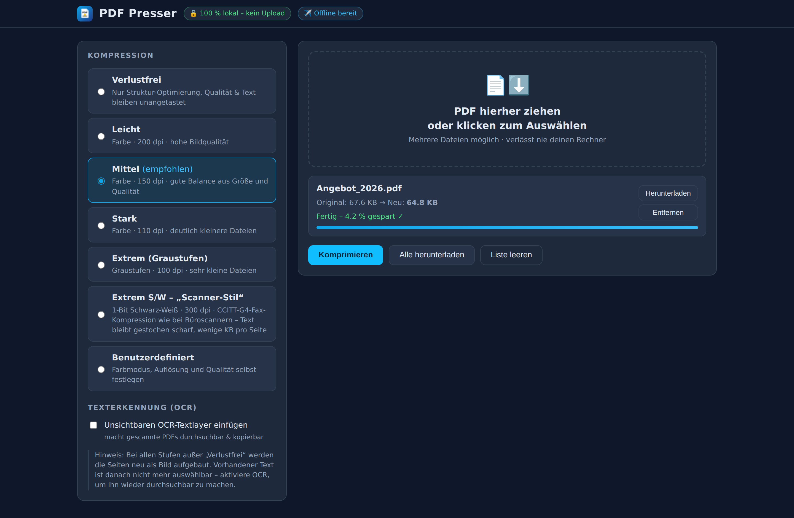

# PDF Presser – Lokaler PDF-Kompressor

**Live:** https://kmitulla.github.io/pdfcompress/

PDF-Dateien direkt im Browser verkleinern – **100 % lokal, ohne Upload**. Als
installierbare Web-App (PWA) funktioniert das Tool nach dem ersten Aufruf auch
**komplett offline**.



## Funktionen

- **Kein Upload:** Alle Verarbeitung (Rendern, Komprimieren, OCR) läuft per
  WebAssembly/JavaScript im Browser. Dateien verlassen das Gerät nie.
- **Kompressionsstufen:** Verlustfrei, Leicht, Mittel, Stark, Extrem
  (Graustufen), Extrem Farbe, Extrem S/W – plus frei einstellbar (Farbmodus,
  dpi, Qualität).
- **„Scanner-Stil“ S/W-Modus:** adaptive 1-Bit-Binarisierung gegen den
  lokalen Hintergrund (wie bei Büroscannern – auch getöntes Papier und
  farbige Flächen bleiben lesbar, statt schwarz zu kippen) mit
  **CCITT-G4-Fax-Kompression**. Text bleibt bei 300 dpi gestochen scharf,
  typischerweise nur wenige KB pro Seite. Pro Seite wird automatisch die
  kleinere von G4- und Flate-Kompression gewählt.
- **„Scanner-Stil“ in Farbe:** Median-Cut-Quantisierung auf 16 Palettenfarben
  mit sauberem weißem Hintergrund (Indexed-ColorSpace + Flate) – der Look von
  Farbscans aus dem Bürogerät bei sehr kleinen Dateien.
- **Helligkeitsregler mit Live-Vorschau:** Für S/W- und Scanner-Stil lässt
  sich der Schwellwert anpassen; die Vorschau zeigt die erste Seite mit den
  aktuellen Einstellungen inklusive geschätzter Größe pro Seite.
- **Simulation:** Rechnet auf Knopfdruck alle Stufen durch und zeigt für jede
  die Nachher-Größe und Ersparnis in % (bei langen Dokumenten hochgerechnet
  aus Beispielseiten).
- **Erneut komprimieren:** Stufe wechseln und dieselben Dateien ohne neue
  Auswahl nochmal durchlaufen lassen. Vorher-/Nachher-Größe wird angezeigt.
- **PDF-Editor:** Unterschreiben (zeichnen mit Vektor-Glättung oder Foto mit
  einstellbarer Freistellung: Schwellwert, Helligkeit, Kontrast, Farbe),
  Signatur-Bibliothek (mehrere speichern & wiederverwenden), Text einfügen,
  Stift/Marker/Radierer, Bilder einfügen, Seiten löschen/umsortieren/
  duplizieren/hinzufügen, Zuschneiden, Formularfelder ausfüllen (mit
  Einbrennen), Zoom & Verschieben (auch Pinch auf Touch). Alle Änderungen
  werden fest ins PDF eingebrannt – **die anschließende Kompression erfasst
  sie immer mit**.
- **Meine Daten:** Unterschriften & Einstellungen bleiben lokal (IndexedDB,
  mit Persistenz-Anfrage) und lassen sich als Datei exportieren und in einem
  anderen Browser 1:1 importieren.
- **Optionaler OCR-Textlayer:** Tesseract (Deutsch/Englisch) legt unsichtbaren
  Text über die Seiten – das PDF wird durchsuch- und kopierbar.
- **Zielordner & Import-Ordner** (Chrome/Edge): Ergebnisse auf Wunsch
  automatisch in einen gewählten Ordner speichern; PDFs direkt aus einem
  Import-Ordner einsammeln (zeigt an, was gefunden wurde).
- **Teilen:** Komprimierte PDFs direkt über den System-Teilen-Dialog
  weitergeben (wo die Web-Share-API verfügbar ist).
- **PWA:** Web-App-Icon, installierbar (Desktop & Mobil), offline-fähig durch
  Service-Worker-Precache aller Assets inklusive OCR-Sprachdaten.
- **Für PC optimiert:** Zwei-Spalten-Layout, Drag & Drop, mehrere Dateien in
  einem Rutsch.

## Technik

| Baustein | Zweck |
| --- | --- |
| [pdf.js](https://mozilla.github.io/pdf.js/) | PDF-Seiten rendern |
| [pdf-lib](https://pdf-lib.js.org/) | Neues PDF zusammenbauen |
| Eigener CCITT-G4-Encoder (`js/ccitt-g4.js`) | 1-Bit-Fax-Kompression nach ITU-T T.6 |
| [tesseract.js](https://tesseract.projectnaptha.com/) | OCR als WebAssembly |

Alle Bibliotheken sind lokal gebündelt (`vendor/`), es gibt keine
CDN-Abhängigkeiten – Voraussetzung für den Offline-Betrieb.

## Lokal starten

```bash
npm install        # nur für Entwicklung/Tests nötig
npm run serve      # http://localhost:8823
```

## Tests

Ende-zu-Ende-Tests (Playwright) prüfen, dass die Kompression wirklich
funktioniert und korrekte PDFs herauskommen:

```bash
npm test
```

- Alle Stufen erzeugen gültige, kleinere PDFs (Seitenzahl, Maße, Inhalt werden
  gerendert und geprüft)
- Gegenprobe mit **PDFium** (Engine von Chrome/Edge): S/W- und Farb-Ausgaben
  werden dort gerendert und auf Lesbarkeit geprüft
- G4-Encoder: Pixel-exakter Vergleich gegen den unabhängigen Flate-Referenzpfad
- Farbreduzierter Modus: Ergebnis enthält nachweislich nur die Palettenfarben
- Helligkeitsregler: verschiebt die Binarisierung messbar in beide Richtungen
- Simulation: alle Stufen liefern plausible Größen
- OCR: Scan ohne Textlayer → Ausgabe enthält den erkannten Text
- UI-Workflow inkl. Download, erneutem Komprimieren, Vorschau, Zielordner-
  Speichern und Import-Ordner (per Mock-Handles)
- PWA: Manifest, Icons, Service Worker, App läuft und komprimiert offline

## Deployment

Jeder Push auf `main` veröffentlicht die App automatisch über GitHub Actions
auf GitHub Pages (`.github/workflows/deploy-pages.yml`).
