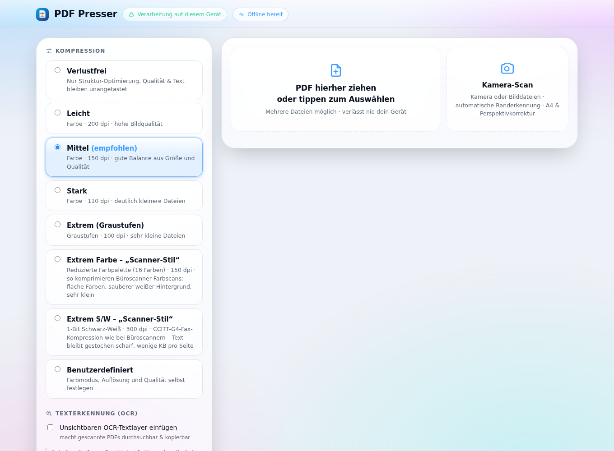

# PDF Presser – Lokaler PDF-Kompressor

**Live:** https://kmitulla.github.io/pdfcompress/

PDF-Dateien direkt im Browser verkleinern – **100 % lokal, ohne Upload**. Als
installierbare Web-App (PWA) funktioniert das Tool nach dem ersten Aufruf auch
**komplett offline**.



Die Oberfläche ist im **„Liquid Glass"-Stil (iOS 26)** gehalten: durchscheinende
Materialien, weiche Übergänge, durchgehendes SVG-Icon-Set (keine Emojis), hell
und dunkel automatisch. Am iPhone stehen Scannen und Dateien oben, am Desktop
gilt das zweispaltige Layout.

## Funktionen

- **Kein Upload:** Alle Verarbeitung (Rendern, Komprimieren, OCR) läuft per
  WebAssembly/JavaScript im Browser. Dateien verlassen das Gerät nie.
- **Kompressionsstufen:** Verlustfrei, Leicht, Mittel, Stark, Extrem
  (Graustufen), Extrem Farbe, Extrem S/W – plus frei einstellbar (Farbmodus,
  dpi, Qualität).
- **„Scanner-Stil“ S/W-Modus:** adaptive 1-Bit-Binarisierung gegen den
  lokalen Hintergrund (wie bei Büroscannern – auch getöntes Papier und
  farbige Flächen bleiben lesbar, statt schwarz zu kippen) mit
  **CCITT-G4-Fax-Kompression**. Text bleibt bei 300 dpi gestochen scharf,
  typischerweise nur wenige KB pro Seite. Pro Seite wird automatisch die
  kleinere von G4- und Flate-Kompression gewählt.
- **„Scanner-Stil“ in Farbe:** Median-Cut-Quantisierung auf 16 Palettenfarben
  mit sauberem weißem Hintergrund (Indexed-ColorSpace + Flate) – der Look von
  Farbscans aus dem Bürogerät bei sehr kleinen Dateien.
- **Feinsteuerung für S/W mit Live-Vorschau:** **Helligkeit** (Schwellwert),
  **Kontrast** (nimmt schwachen Text mit bzw. lässt nur kräftige Tinte stehen)
  und **dunkle Flächen** (als Farbbalken behandeln, ignorieren oder
  automatisch entscheiden). Letzteres verhindert, dass bei dunklen Fotos oder
  Bildschirmaufnahmen der ganze Rand schwarz zuläuft und den Text erdrückt –
  am realen Beispiel fiel der Schwarzanteil am Rand von 93 % auf 15 %, ohne
  Text zu verlieren. Die Vorschau zeigt die Wirkung sofort samt geschätzter
  Größe pro Seite.
- **Vorschau mit Seitennavigation & Seiten-Einstellungen:** In der Vorschau
  durch **alle Seiten blättern** und einzelnen Seiten eine **eigene
  Kompressionsstufe samt S/W-Helligkeitsabgleich** zuweisen (z. B. Seite 3
  als „Extrem S/W“, Rest in Farbe) – wird beim Komprimieren automatisch
  angewendet.
- **Simulation:** Rechnet auf Knopfdruck alle Stufen durch und zeigt für jede
  die Nachher-Größe und Ersparnis in % (bei langen Dokumenten hochgerechnet
  aus Beispielseiten).
- **Erneut komprimieren:** Stufe wechseln und dieselben Dateien ohne neue
  Auswahl nochmal durchlaufen lassen. Vorher-/Nachher-Größe wird angezeigt.
- **Dokumenten-Scanner:** Vorlagen mit der **Kamera** (inkl. optionalem
  Blitz/Taschenlampe, wo der Browser es unterstützt) oder aus **Bilddateien**
  scannen. Die Dokumentränder werden **automatisch erkannt** (live schon im
  Kamerabild) und lassen sich **manuell nachjustieren** – eine **Lupe** neben
  dem Finger zeigt die Ecke stark vergrößert, damit man sie exakt trifft;
  Kanten lassen sich als Ganzes verschieben, Pfeiltasten justieren fein nach.
  Perspektivkorrektur, wahlweise **A4-Layout** (hoch/quer – der Scan wird
  dabei **unverzerrt eingepasst**, Strecken auf das volle Blatt ist optional)
  oder automatisches Seitenverhältnis, **Drehen in 90°-Schritten**, ein
  **weißer Radierer** mit einstellbarer Pinselgröße und Undo/Redo für
  Ränder/Schatten, mehrere Seiten mit Umsortieren/Neuzuschnitt. Das Ergebnis
  landet als PDF in der Dateiliste –
  dort wie gewohnt **Kompressionsstufe & „Scan-Stil“** wählen (z. B.
  „Extrem S/W – Scanner-Stil“).
- **PDF-Editor:** Unterschreiben (zeichnen mit Vektor-Glättung oder Foto mit
  einstellbarer Freistellung: Schwellwert, Helligkeit, Kontrast, Farbe),
  Signatur-Bibliothek (mehrere speichern & wiederverwenden), Text einfügen,
  Stift/Marker/Radierer, Bilder einfügen, Seiten löschen/umsortieren/
  duplizieren/hinzufügen, Zuschneiden, Formularfelder ausfüllen (mit
  Einbrennen), Zoom & Verschieben (auch Pinch auf Touch). Alle Änderungen
  werden fest ins PDF eingebrannt – **die anschließende Kompression erfasst
  sie immer mit**.
- **Meine Daten:** Unterschriften & Einstellungen bleiben lokal (IndexedDB,
  mit Persistenz-Anfrage) und lassen sich als Datei exportieren und in einem
  anderen Browser 1:1 importieren.
- **Optionaler OCR-Textlayer:** Tesseract (Deutsch/Englisch) legt unsichtbaren
  Text über die Seiten – das PDF wird durchsuch- und kopierbar.
- **Zielordner & Import-Ordner** (Chrome/Edge): Ergebnisse auf Wunsch
  automatisch in einen gewählten Ordner speichern; PDFs direkt aus einem
  Import-Ordner einsammeln (zeigt an, was gefunden wurde).
- **Teilen:** Komprimierte PDFs direkt über den System-Teilen-Dialog
  weitergeben (wo die Web-Share-API verfügbar ist).
- **PWA:** Web-App-Icon, installierbar (Desktop & Mobil), offline-fähig durch
  Service-Worker-Precache aller Assets inklusive OCR-Sprachdaten.
- **Für PC optimiert:** Zwei-Spalten-Layout, Drag & Drop, mehrere Dateien in
  einem Rutsch.

## Technik

| Baustein | Zweck |
| --- | --- |
| [pdf.js](https://mozilla.github.io/pdf.js/) | PDF-Seiten rendern |
| [pdf-lib](https://pdf-lib.js.org/) | Neues PDF zusammenbauen |
| Eigener CCITT-G4-Encoder (`js/ccitt-g4.js`) | 1-Bit-Fax-Kompression nach ITU-T T.6 |
| [tesseract.js](https://tesseract.projectnaptha.com/) | OCR als WebAssembly |

Alle Bibliotheken sind lokal gebündelt (`vendor/`), es gibt keine
CDN-Abhängigkeiten – Voraussetzung für den Offline-Betrieb.

## Lokal starten

```bash
npm install        # nur für Entwicklung/Tests nötig
npm run serve      # http://localhost:8823
```

## Tests

Ende-zu-Ende-Tests (Playwright) prüfen, dass die Kompression wirklich
funktioniert und korrekte PDFs herauskommen:

```bash
npm test
```

- Alle Stufen erzeugen gültige, kleinere PDFs (Seitenzahl, Maße, Inhalt werden
  gerendert und geprüft)
- Gegenprobe mit **PDFium** (Engine von Chrome/Edge): S/W- und Farb-Ausgaben
  werden dort gerendert und auf Lesbarkeit geprüft
- G4-Encoder: Pixel-exakter Vergleich gegen den unabhängigen Flate-Referenzpfad
- Farbreduzierter Modus: Ergebnis enthält nachweislich nur die Palettenfarben
- Helligkeitsregler: verschiebt die Binarisierung messbar in beide Richtungen
- Simulation: alle Stufen liefern plausible Größen
- OCR: Scan ohne Textlayer → Ausgabe enthält den erkannten Text
- UI-Workflow inkl. Download, erneutem Komprimieren, Vorschau, Zielordner-
  Speichern und Import-Ordner (per Mock-Handles)
- PWA: Manifest, Icons, Service Worker, App läuft und komprimiert offline

## Selbst hosten: Netzwerk-Scanner & „an Paperless" (Docker/Portainer)

Zusätzlich zum reinen Browser-Betrieb lässt sich die App als **Docker-Container**
auf einem eigenen Server/Mini-PC betreiben. Dann kommen drei Funktionen dazu, die
im Browser allein nicht möglich sind:

- **Netzwerk-Scanner (eSCL/AirScan):** Seiten direkt von einem Netzwerk-Scanner
  wie dem **Epson ET-2720** einlesen – auch vom Handy. Der Scan öffnet sich im
  gewohnten Zuschnitt-/A4-/Perspektiv-Editor; **weitere Seiten lassen sich
  anfügen**, bis das mehrseitige PDF vollständig ist.
- **„An Paperless":** Das fertige, komprimierte PDF landet per Tipp (auf Wunsch
  automatisch) in einem überwachten Ordner, aus dem **Paperless** es
  weiterverarbeitet. Geschrieben wird atomar, damit Paperless nie eine halbe
  Datei sieht.
- **Profil auf dem eigenen Server:** Einstellungen, Unterschriften und Stempel
  gelten auf **allen** Geräten (iPhone + Laptop).

Das mitgelieferte Backend (`server/`) liefert die Web-App aus **und** stellt die
API bereit (`/api/scanner/scan`, `/api/save`, `/api/profile`) – same-origin, ohne
externe Abhängigkeiten. Ist kein Backend vorhanden (z. B. auf GitHub Pages),
blenden sich diese Funktionen einfach aus und **alles bleibt rein lokal**.

```bash
# Schnellstart ohne Docker:
SCANNER_HOST=192.168.1.50 CONSUME_DIR=./consume npm start   # http://localhost:8823

# Oder als Container / Portainer-Stack:
docker compose up -d --build
```

**Komplette Schritt-für-Schritt-Anleitung** (Portainer, Epson-Einrichtung,
NAS-Mount, Paperless, mehrseitiges Scannen, Updates, Fehlersuche):
[`docs/portainer-nas-scanner-setup.md`](docs/portainer-nas-scanner-setup.md).

| Umgebungsvariable | Zweck |
| --- | --- |
| `SCANNER_HOST` | IP/Host des Scanners (z. B. `192.168.1.50`, bei Bedarf `https://…`) – leer = Scanner aus |
| `CONSUME_DIR` | Zielordner im Container (Standard `/data/consume`, auf den Paperless-Ordner gemountet) |
| `DATA_DIR` | Profilspeicher für Einstellungen/Unterschriften (Standard `/data/app`) |
| `PORT` | Server-Port (Standard `8823`) |

### Wo läuft die Rechenarbeit?

**Auf dem Gerät, an dem du sitzt** – nicht auf dem Server. Rendern, Zuschneiden,
Kompression und OCR laufen im Browser (iPhone/Laptop). Der Server macht nur
Scanner-Zugriff, Dateiablage und Profilspeicher.

## Deployment (GitHub Pages)

Jeder Push auf `main` veröffentlicht die (rein clientseitige) App automatisch
über GitHub Actions auf GitHub Pages (`.github/workflows/deploy-pages.yml`).
Dort stehen Scanner-/Paperless-Funktionen nicht zur Verfügung (kein Backend);
dafür den Docker-/Portainer-Weg oben nutzen.
